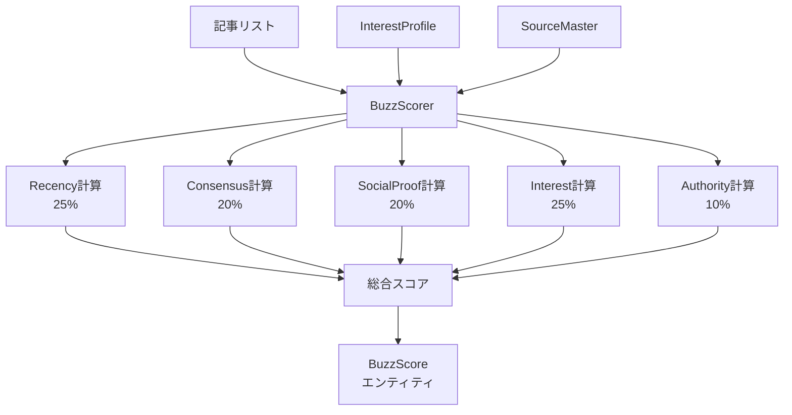

# 設計書

## アーキテクチャ概要

Buzzスコア算出を5要素統合型に拡張する。各要素は独立したスコア計算ロジックを持ち、最終的に重み付け合算する。

**設計原則**:
- **疎結合**: 各要素のスコア計算は独立したメソッドで実装
- **拡張性**: 新しい要素（SNS指標等）の追加が容易
- **テスタビリティ**: 各要素のスコア計算を個別にテスト可能



## コンポーネント設計

### 1. BuzzScore モデルの拡張

**責務**:
- 5要素のスコアを保持
- 総合スコアを計算・保持

**実装内容**:

```python
"""Buzzスコアエンティティモジュール."""

from dataclasses import dataclass


@dataclass
class BuzzScore:
    """話題性スコア（非LLM計算）.

    記事の話題性を5つの要素から定量化したスコア.

    Attributes:
        url: 記事URL
        # 各要素のスコア（0-100）
        recency_score: 鮮度スコア
        consensus_score: 複数ソース出現スコア
        social_proof_score: 外部反応スコア（はてブ数など）
        interest_score: 興味との一致度スコア
        authority_score: 公式補正スコア
        # メタデータ
        source_count: 複数ソース出現回数（Consensus計算の元データ）
        social_proof_count: 外部反応数（はてブ数）
        # 総合スコア
        total_score: 総合Buzzスコア（0-100）
    """

    url: str
    # 各要素スコア
    recency_score: float
    consensus_score: float
    social_proof_score: float
    interest_score: float
    authority_score: float
    # メタデータ
    source_count: int
    social_proof_count: int
    # 総合スコア
    total_score: float
```

**実装の要点**:
- 既存のフィールド（`domain_diversity_score`）は削除（重みが小さく効果が限定的）
- 各要素スコアは0-100の範囲に正規化
- メタデータ（source_count, social_proof_count）は分析・デバッグ用に保持

### 2. SourceConfig モデルの拡張

**責務**:
- 収集元の公式度（authority_level）を管理

**実装内容**:

`config/sources.yaml`に`authority_level`フィールドを追加:

```yaml
sources:
  - source_id: aws_blog
    name: AWS Blog
    feed_url: https://aws.amazon.com/blogs/aws/feed/
    feed_type: rss
    priority: high
    timeout_seconds: 15
    retry_count: 3
    enabled: true
    authority_level: official  # 新規追加

  - source_id: hacker_news
    name: Hacker News
    feed_url: https://news.ycombinator.com/rss
    feed_type: rss
    priority: high
    timeout_seconds: 15
    retry_count: 3
    enabled: true
    authority_level: medium  # 新規追加
```

`src/repositories/source_master.py`のSourceConfigモデルに追加:

```python
from enum import StrEnum

class AuthorityLevel(StrEnum):
    """公式度レベル."""
    OFFICIAL = "official"
    HIGH = "high"
    MEDIUM = "medium"
    LOW = "low"

@dataclass
class SourceConfig:
    # ... 既存フィールド
    authority_level: AuthorityLevel = AuthorityLevel.LOW  # デフォルト: low
```

**実装の要点**:
- `authority_level`は省略可能（デフォルト: `low`）
- 既存のsources.yamlとの互換性を維持

### 3. SocialProofFetcher（新規コンポーネント）

**責務**:
- はてなブックマーク数を取得
- エラーハンドリング・並列度制限

**実装内容**:

```python
"""SocialProof取得サービスモジュール."""

import asyncio
import httpx
from typing import Any

from src.shared.logging.logger import get_logger

logger = get_logger(__name__)


class SocialProofFetcher:
    """SocialProof（外部反応）取得サービス.

    はてなブックマーク数を取得する.

    Attributes:
        _timeout: タイムアウト（秒）
        _concurrency_limit: 並列度制限
    """

    HATENA_API_URL = "https://bookmark.hatenaapis.com/count/entry?url={url}"

    def __init__(self, timeout: int = 5, concurrency_limit: int = 10) -> None:
        """SocialProof取得サービスを初期化する.

        Args:
            timeout: タイムアウト（秒、デフォルト: 5）
            concurrency_limit: 並列度制限（デフォルト: 10）
        """
        self._timeout = timeout
        self._concurrency_limit = concurrency_limit

    async def fetch_batch(self, urls: list[str]) -> dict[str, int]:
        """複数URLのはてブ数を一括取得する.

        Args:
            urls: URLリスト

        Returns:
            URLをキーとするはてブ数の辞書
        """
        logger.info("social_proof_fetch_start", url_count=len(urls))

        semaphore = asyncio.Semaphore(self._concurrency_limit)

        async def fetch_with_semaphore(url: str) -> tuple[str, int]:
            async with semaphore:
                return url, await self._fetch_single(url)

        tasks = [fetch_with_semaphore(url) for url in urls]
        results = await asyncio.gather(*tasks, return_exceptions=True)

        # 結果を集約
        counts: dict[str, int] = {}
        failed_count = 0

        for result in results:
            if isinstance(result, Exception):
                logger.warning("social_proof_fetch_failed", error=str(result))
                failed_count += 1
            elif isinstance(result, tuple):
                url, count = result
                counts[url] = count

        logger.info(
            "social_proof_fetch_complete",
            total_count=len(urls),
            success_count=len(counts),
            failed_count=failed_count,
        )

        return counts

    async def _fetch_single(self, url: str) -> int:
        """単一URLのはてブ数を取得する.

        Args:
            url: 記事URL

        Returns:
            はてブ数（取得失敗時は0）
        """
        try:
            async with httpx.AsyncClient(timeout=self._timeout) as client:
                response = await client.get(self.HATENA_API_URL.format(url=url))
                response.raise_for_status()

                count = int(response.text or "0")

                logger.debug("hatena_bookmark_fetched", url=url, count=count)

                return count

        except (httpx.HTTPError, ValueError) as e:
            logger.warning("hatena_bookmark_fetch_failed", url=url, error=str(e))
            return 0
```

**実装の要点**:
- httpx.AsyncClientで非同期並列取得
- タイムアウト・並列度制限あり
- エラー時は0を返して継続（ログ記録）

### 4. BuzzScorer の改修

**責務**:
- 5要素のスコアを計算
- 重み付け合算して総合スコアを算出

**実装内容**:

```python
"""Buzzスコア計算サービスモジュール."""

import asyncio
from collections import Counter
from urllib.parse import urlparse

from src.models.article import Article
from src.models.buzz_score import BuzzScore
from src.models.interest_profile import InterestProfile
from src.repositories.source_master import SourceMaster, AuthorityLevel
from src.services.social_proof_fetcher import SocialProofFetcher
from src.shared.logging.logger import get_logger
from src.shared.utils.date_utils import now_utc

logger = get_logger(__name__)


class BuzzScorer:
    """Buzzスコア計算サービス（5要素統合版）.

    スコア計算式:
    - recency_score = max(100 - (days_old * 10), 0)
    - consensus_score = min(source_count * 20, 100)
    - social_proof_score = はてブ数に応じたスコア（0, 20, 50, 70, 100）
    - interest_score = InterestProfileとのマッチング度（0-100）
    - authority_score = authority_levelに応じたスコア（0, 50, 80, 100）
    - total_score = (recency × 0.25) + (consensus × 0.20) + (social_proof × 0.20) + (interest × 0.25) + (authority × 0.10)
    """

    # 重み配分
    WEIGHT_RECENCY = 0.25
    WEIGHT_CONSENSUS = 0.20
    WEIGHT_SOCIAL_PROOF = 0.20
    WEIGHT_INTEREST = 0.25
    WEIGHT_AUTHORITY = 0.10

    def __init__(
        self,
        interest_profile: InterestProfile,
        source_master: SourceMaster,
        social_proof_fetcher: SocialProofFetcher,
    ) -> None:
        """Buzzスコア計算サービスを初期化する.

        Args:
            interest_profile: 興味プロファイル
            source_master: 収集元マスタ
            social_proof_fetcher: SocialProof取得サービス
        """
        self._interest_profile = interest_profile
        self._source_master = source_master
        self._social_proof_fetcher = social_proof_fetcher

    async def calculate_scores(self, articles: list[Article]) -> dict[str, BuzzScore]:
        """全記事のBuzzスコアを計算する（非同期版）.

        Args:
            articles: 重複排除済み記事のリスト

        Returns:
            スコア辞書（normalized_url -> BuzzScore）
        """
        logger.info("buzz_scoring_start", article_count=len(articles))

        # 前処理: URL出現回数を集計
        url_counts: dict[str, int] = Counter(article.normalized_url for article in articles)

        # SocialProof（はてブ数）を一括取得
        urls = [article.url for article in articles]
        social_proof_counts = await self._social_proof_fetcher.fetch_batch(urls)

        # 各記事のスコアを計算
        scores: dict[str, BuzzScore] = {}

        for article in articles:
            recency_score = self._calculate_recency_score(article)
            consensus_score = self._calculate_consensus_score(article.normalized_url, url_counts)
            social_proof_score = self._calculate_social_proof_score(
                article.url, social_proof_counts
            )
            interest_score = self._calculate_interest_score(article)
            authority_score = self._calculate_authority_score(article.source_name)

            total_score = self._calculate_total_score(
                recency_score,
                consensus_score,
                social_proof_score,
                interest_score,
                authority_score,
            )

            buzz_score = BuzzScore(
                url=article.url,
                recency_score=recency_score,
                consensus_score=consensus_score,
                social_proof_score=social_proof_score,
                interest_score=interest_score,
                authority_score=authority_score,
                source_count=url_counts.get(article.normalized_url, 1),
                social_proof_count=social_proof_counts.get(article.url, 0),
                total_score=total_score,
            )

            scores[article.normalized_url] = buzz_score

            logger.debug(
                "buzz_score_calculated",
                url=article.url,
                total_score=total_score,
                recency=recency_score,
                consensus=consensus_score,
                social_proof=social_proof_score,
                interest=interest_score,
                authority=authority_score,
            )

        logger.info("buzz_scoring_complete", score_count=len(scores))

        return scores

    def _calculate_recency_score(self, article: Article) -> float:
        """Recency（鮮度）スコアを計算する."""
        now = now_utc()
        days_old = (now - article.published_at).days
        return max(100.0 - (days_old * 10.0), 0.0)

    def _calculate_consensus_score(
        self, normalized_url: str, url_counts: dict[str, int]
    ) -> float:
        """Consensus（複数ソース出現）スコアを計算する."""
        source_count = url_counts.get(normalized_url, 1)
        return min(source_count * 20.0, 100.0)

    def _calculate_social_proof_score(
        self, url: str, social_proof_counts: dict[str, int]
    ) -> float:
        """SocialProof（外部反応）スコアを計算する."""
        count = social_proof_counts.get(url, 0)

        if count >= 100:
            return 100.0
        elif count >= 50:
            return 70.0
        elif count >= 10:
            return 50.0
        elif count >= 1:
            return 20.0
        else:
            return 0.0

    def _calculate_interest_score(self, article: Article) -> float:
        """Interest（興味との一致度）スコアを計算する."""
        text = f"{article.title} {article.description}".lower()

        # high_interestトピックとのマッチング
        for topic in self._interest_profile.high_interest:
            if self._match_topic(topic, text):
                return 100.0

        # medium_interestトピックとのマッチング
        for topic in self._interest_profile.medium_interest:
            if self._match_topic(topic, text):
                return 60.0

        # low_priorityトピックとのマッチング
        for topic in self._interest_profile.low_priority:
            if self._match_topic(topic, text):
                return 20.0

        # いずれにも一致しない場合はデフォルト
        return 40.0

    def _match_topic(self, topic: str, text: str) -> bool:
        """トピックとテキストのマッチング判定.

        Args:
            topic: トピック文字列（例: "AI/ML（大規模言語モデル、機械学習基盤）"）
            text: 記事タイトル+概要の結合テキスト

        Returns:
            マッチングした場合True
        """
        # トピックからキーワードを抽出（括弧内・カンマ区切り）
        keywords = []

        # 括弧外のメインキーワード
        main = topic.split("（")[0].split("(")[0].strip()
        keywords.append(main.lower())

        # 括弧内のサブキーワード
        if "（" in topic or "(" in topic:
            sub = topic.split("（")[-1].split("(")[-1].split("）")[0].split(")")[0]
            keywords.extend([k.strip().lower() for k in sub.split("、") if k.strip()])
            keywords.extend([k.strip().lower() for k in sub.split(",") if k.strip()])

        # いずれかのキーワードが含まれればマッチ
        return any(keyword in text for keyword in keywords if keyword)

    def _calculate_authority_score(self, source_name: str) -> float:
        """Authority（公式補正）スコアを計算する."""
        # SourceMasterからsource_nameに対応するSourceConfigを取得
        sources = self._source_master.get_all_sources()
        source_config = next((s for s in sources if s.name == source_name), None)

        if source_config is None:
            return 0.0

        # authority_levelに応じたスコア
        authority_level = source_config.authority_level

        if authority_level == AuthorityLevel.OFFICIAL:
            return 100.0
        elif authority_level == AuthorityLevel.HIGH:
            return 80.0
        elif authority_level == AuthorityLevel.MEDIUM:
            return 50.0
        else:  # LOW or 未設定
            return 0.0

    def _calculate_total_score(
        self,
        recency: float,
        consensus: float,
        social_proof: float,
        interest: float,
        authority: float,
    ) -> float:
        """総合Buzzスコアを計算する（重み付け合算）."""
        return (
            (recency * self.WEIGHT_RECENCY)
            + (consensus * self.WEIGHT_CONSENSUS)
            + (social_proof * self.WEIGHT_SOCIAL_PROOF)
            + (interest * self.WEIGHT_INTEREST)
            + (authority * self.WEIGHT_AUTHORITY)
        )
```

**実装の要点**:
- InterestProfile, SourceMaster, SocialProofFetcherをDI経由で受け取る
- 各要素のスコア計算は独立したメソッド
- 重み定数をクラス変数で管理（将来的にYAML化可能）
- 非同期処理（SocialProof取得のため）

### 5. Orchestrator の改修

**責務**:
- BuzzScorerの初期化時にInterestProfile、SourceMaster、SocialProofFetcherを渡す
- 非同期呼び出しに対応

**変更箇所**:

```python
# Orchestrator.execute() 内

# SocialProofFetcher初期化
social_proof_fetcher = SocialProofFetcher(timeout=5, concurrency_limit=10)

# BuzzScorer初期化（依存関係注入）
buzz_scorer = BuzzScorer(
    interest_profile=interest_profile,
    source_master=source_master,
    social_proof_fetcher=social_proof_fetcher,
)

# Buzzスコア計算（非同期）
buzz_scores = await buzz_scorer.calculate_scores(deduped_articles)
```

## データフロー

### Buzzスコア計算フロー

```
1. Orchestrator
   → InterestMaster.get_profile() でInterestProfileを取得
   → SourceMasterを初期化
   → SocialProofFetcherを初期化
   → BuzzScorerを初期化（DI）

2. BuzzScorer.calculate_scores(articles)
   → SocialProofFetcher.fetch_batch() ではてブ数を一括取得
   → 各記事に対して5要素のスコアを計算:
      - Recency: 公開日時から計算
      - Consensus: URL出現回数から計算
      - SocialProof: はてブ数から計算
      - Interest: InterestProfileとマッチング
      - Authority: SourceMasterから取得
   → 重み付け合算して総合スコア算出
   → BuzzScoreインスタンス生成

3. CandidateSelector.select(articles, buzz_scores)
   → 総合スコア降順でソート
   → 上位150件を選定
```

## エラーハンドリング戦略

### SocialProof取得のエラー

- **タイムアウト**: 5秒でタイムアウト、0点として継続
- **HTTP エラー**: ログ記録して0点として継続
- **JSON解析エラー**: ログ記録して0点として継続

### Authority取得のエラー

- **source_name不一致**: SourceMasterにない場合は0点
- **authority_level未設定**: デフォルトでLOW（0点）

### Interest計算のエラー

- **InterestProfile未設定**: デフォルトスコア（40点）
- **マッチング失敗**: いずれにも一致しない場合は40点

## テスト戦略

### ユニットテスト

#### tests/unit/services/test_social_proof_fetcher.py
- はてブAPI正常レスポンスのパース
- タイムアウトエラーハンドリング
- HTTP エラーハンドリング
- 並列度制限の検証

#### tests/unit/services/test_buzz_scorer.py
- 各要素スコア計算のロジック検証
  - `_calculate_recency_score`
  - `_calculate_consensus_score`
  - `_calculate_social_proof_score`
  - `_calculate_interest_score`
  - `_calculate_authority_score`
- 総合スコア計算の重み配分検証
- 境界値テスト（0点、100点）

#### tests/unit/models/test_buzz_score.py
- BuzzScoreインスタンス生成
- 各フィールドの型検証

### 統合テスト

#### tests/integration/test_buzz_scorer_integration.py
- 実際のInterestProfile、SourceMasterを使用した統合テスト
- SocialProofFetcherのモック使用
- 取りこぼし防止のシナリオ検証:
  - 公式ブログ（Authority高）が低SocialProofでも一定スコアを維持
  - Interest一致記事が同条件で優先される
  - 話題記事（SocialProof高）が興味外でも一定スコアを維持

### E2Eテスト

#### tests/e2e/test_orchestrator_e2e.py（更新）
- Orchestratorの初期化でBuzzScorerが正しく動作すること
- dry_runモードで5要素が正しく計算されていることをログで確認

## 依存ライブラリ

新規追加:
- **httpx**: はてブAPI呼び出し（既に使用中）

## ディレクトリ構造

```
ai-curated-newsletter/
├── config/
│   ├── sources.yaml          # 更新（authority_level追加）
│   └── interests.yaml         # 既存（interest-list-master で作成）
│
├── src/
│   ├── models/
│   │   ├── buzz_score.py      # 更新（フィールド追加）
│   │   └── ...
│   │
│   ├── repositories/
│   │   ├── source_master.py   # 更新（AuthorityLevel追加）
│   │   └── ...
│   │
│   └── services/
│       ├── buzz_scorer.py     # 大幅改修（5要素統合）
│       ├── social_proof_fetcher.py  # 新規追加
│       └── ...
│
└── tests/
    ├── unit/
    │   ├── services/
    │   │   ├── test_buzz_scorer.py  # 更新
    │   │   └── test_social_proof_fetcher.py  # 新規追加
    │   └── models/
    │       └── test_buzz_score.py   # 更新
    │
    └── integration/
        └── test_buzz_scorer_integration.py  # 新規追加
```

## 実装の順序

1. **config/sources.yaml の更新**
   - authority_levelフィールドを追加

2. **src/repositories/source_master.py の更新**
   - AuthorityLevel Enumを追加
   - SourceConfigにauthority_levelフィールドを追加

3. **src/models/buzz_score.py の更新**
   - 新しいフィールドを追加

4. **src/services/social_proof_fetcher.py の実装**
   - SocialProofFetcherクラスを実装

5. **src/services/buzz_scorer.py の改修**
   - 5要素統合版に書き換え

6. **src/orchestrator/orchestrator.py の改修**
   - BuzzScorerの初期化を更新
   - 非同期呼び出しに対応

7. **テストの追加・更新**
   - ユニットテスト追加
   - 統合テスト追加
   - E2Eテスト更新

8. **品質チェック**
   - pytest, ruff, mypy 実行
   - dry_run実行で動作確認

## セキュリティ考慮事項

- **はてブAPI**: 公開APIであり、認証不要。レート制限に注意（並列度10件で制限）
- **タイムアウト**: 5秒で打ち切り、無限待機を防止

## パフォーマンス考慮事項

- **はてブAPI並列取得**: 10件同時取得、全体で15秒程度（150記事）
- **非同期処理**: asyncio使用で効率化
- **キャッシュ検討**: はてブ数は頻繁に変わらないため、Phase 2でキャッシュを検討

## 将来の拡張性

### Phase 2以降の拡張方針

1. **SNS指標の追加**
   - Twitter/X、Reddit等のSocialProof指標を追加
   - SocialProofFetcherを拡張

2. **重み配分のYAML管理**
   - `config/buzz_weights.yaml`で重み配分を外部化
   - A/Bテストで最適化

3. **機械学習による重み最適化**
   - ユーザーフィードバックを元に重みを自動調整

4. **SocialProofのキャッシュ**
   - DynamoDBにはてブ数をキャッシュし、API呼び出しを削減
