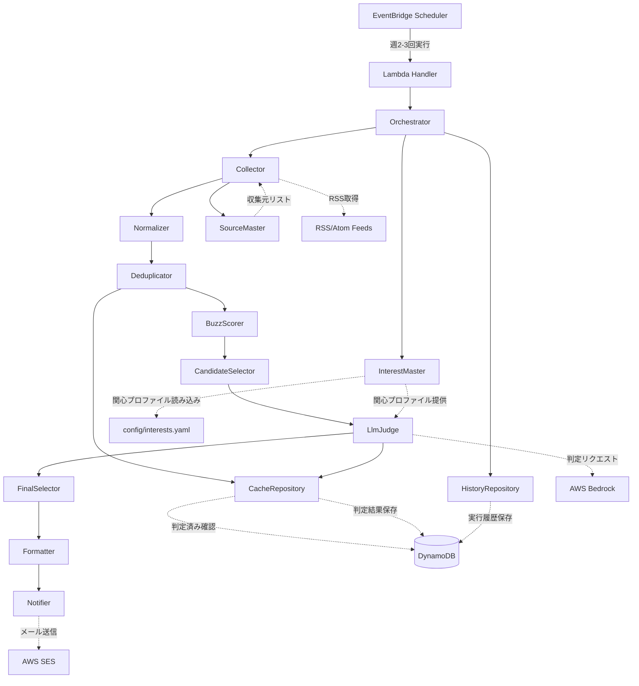
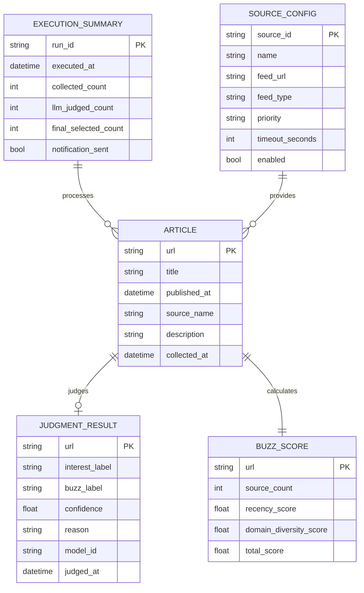
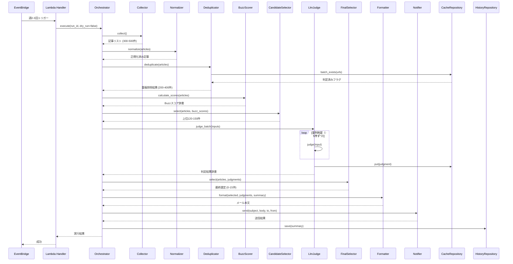
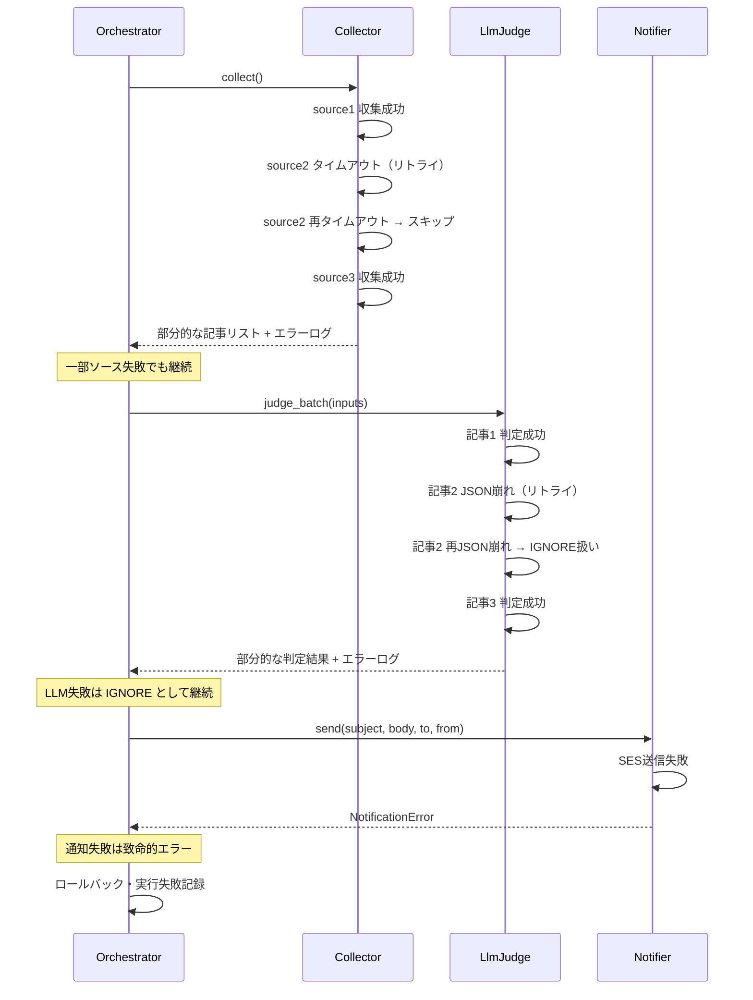

# 機能設計書 (Functional Design Document)

## システム構成図



## 技術スタック

| 分類 | 技術 | 選定理由 |
|------|------|----------|
| 言語 | Python 3.14 | AWS Lambda標準サポート、型ヒント・dataclass対応、豊富なライブラリ |
| 実行環境 | AWS Lambda | サーバーレス、低コスト、自動スケール、週2-3回実行に最適 |
| スケジューラ | AWS EventBridge | cron形式のスケジュール実行、Lambdaとのネイティブ連携 |
| データストア | DynamoDB | サーバーレス、オンデマンドモード、キャッシュ・履歴保存に最適 |
| LLM | AWS Bedrock (Claude 3.5 Sonnet) | JSON出力の信頼性、コスト効率、AWS統合 |
| 通知 | AWS SES | 低コスト、信頼性、HTMLメール対応 |
| RSS/Atom解析 | feedparser | Python標準的なRSS/Atomパーサー |
| HTTP クライアント | httpx | async対応、タイムアウト・リトライ機能 |
| 構造化ログ | structlog | JSON形式ログ、CloudWatch Logs連携 |
| 型チェック | mypy | 静的型検査、バグ予防 |
| テスト | pytest | Python標準的なテストフレームワーク |

## データモデル定義

### エンティティ: Article（記事）

```python
from dataclasses import dataclass
from datetime import datetime

@dataclass
class Article:
    """記事エンティティ.

    Attributes:
        url: 正規化されたURL（一意キー）
        title: 記事タイトル
        published_at: 公開日時（UTC）
        source_name: ソース名（例: "Hacker News"）
        description: 記事の概要（最大800文字）
        normalized_url: 正規化前の元URL
        collected_at: 収集日時（UTC）
    """
    url: str                    # 正規化されたURL（PKとして使用）
    title: str                  # 記事タイトル
    published_at: datetime      # 公開日時（UTC）
    source_name: str            # ソース名
    description: str            # 概要（最大800文字）
    normalized_url: str         # 正規化前URL
    collected_at: datetime      # 収集日時（UTC）
```

**制約**:
- `url`: 必須、正規化済み、一意キー
- `title`: 必須、最大500文字
- `description`: 最大800文字、空文字列可
- `published_at`: UTC ISO8601形式
- `source_name`: 収集元マスタのsource_idと一致

### エンティティ: JudgmentResult（判定結果）

```python
from dataclasses import dataclass
from datetime import datetime
from enum import Enum


class InterestLabel(str, Enum):
    """関心度ラベル."""
    ACT_NOW = "ACT_NOW"
    THINK = "THINK"
    FYI = "FYI"
    IGNORE = "IGNORE"


class BuzzLabel(str, Enum):
    """話題性ラベル."""
    HIGH = "HIGH"
    MID = "MID"
    LOW = "LOW"


@dataclass
class JudgmentResult:
    """LLM判定結果.

    Attributes:
        url: 記事URL（キャッシュキー）
        title: 記事タイトル
        description: 記事の概要（最大800文字）
        interest_label: 関心度ラベル
        buzz_label: 話題性ラベル
        confidence: 信頼度（0.0-1.0）
        reason: 判定理由（短文）
        model_id: 使用したLLMモデルID
        judged_at: 判定日時（UTC）
    """
    url: str                    # 記事URL
    title: str                  # 記事タイトル
    description: str            # 記事の概要（最大800文字）
    interest_label: InterestLabel  # ACT_NOW | THINK | FYI | IGNORE
    buzz_label: BuzzLabel       # HIGH | MID | LOW
    confidence: float           # 0.0-1.0
    reason: str                 # 判定理由（最大200文字）
    model_id: str               # 例: "claude-3-5-sonnet-20241022"
    judged_at: datetime         # 判定日時（UTC）
```

**制約**:
- `url`: 必須、正規化済み、一意キー
- `title`: 必須、最大500文字（Articleから継承）
- `description`: 最大800文字、空文字列可（Articleから継承）
- `interest_label`: 4つの値のみ許可
- `buzz_label`: 3つの値のみ許可
- `confidence`: 0.0-1.0の範囲
- `reason`: 最大200文字

### エンティティ: InterestProfile（関心プロファイル）

```python
from dataclasses import dataclass

@dataclass
class JudgmentCriterion:
    """判定基準の定義.

    Attributes:
        label: 判定ラベル（ACT_NOW/THINK/FYI/IGNORE）
        description: 判定基準の説明
        examples: 該当する記事の例
    """
    label: str
    description: str
    examples: list[str]

@dataclass
class InterestProfile:
    """関心プロファイル.

    Attributes:
        summary: プロファイルの概要
        high_interest: 高い関心を持つトピックのリスト
        medium_interest: 中程度の関心を持つトピックのリスト
        low_priority: 低優先度のトピックのリスト
        criteria: 判定基準の辞書（キー: act_now/think/fyi/ignore）
    """
    summary: str
    high_interest: list[str]
    medium_interest: list[str]
    low_priority: list[str]
    criteria: dict[str, JudgmentCriterion]
```

**制約**:
- `summary`: 必須、プロファイルの概要説明
- `high_interest`, `medium_interest`, `low_priority`: 空リスト可
- `criteria`: act_now, think, fyi, ignoreの4つのキーを持つ

**利用方法**:
- `config/interests.yaml`から読み込み
- `InterestMaster`リポジトリ経由で取得
- `LlmJudge`でプロンプト生成時に使用

### エンティティ: BuzzScore（話題性スコア）

```python
from dataclasses import dataclass

@dataclass
class BuzzScore:
    """話題性スコア（非LLM計算、5要素統合版）.

    Attributes:
        url: 記事URL
        recency_score: 鮮度スコア（0-100）
        consensus_score: 複数ソース出現スコア（0-100）
        social_proof_score: 外部反応スコア（0-100）
        interest_score: 興味との一致度スコア（0-100）
        authority_score: 公式補正スコア（0-100）
        source_count: 複数ソース出現回数（メタデータ）
        social_proof_count: 外部反応数（はてブ数、メタデータ）
        total_score: 総合Buzzスコア（0-100）
    """
    url: str                       # 記事URL
    # 各要素スコア（0-100）
    recency_score: float           # 鮮度スコア
    consensus_score: float         # 複数ソース出現スコア
    social_proof_score: float      # 外部反応スコア（はてブ数など）
    interest_score: float          # 興味との一致度スコア
    authority_score: float         # 公式補正スコア
    # メタデータ
    source_count: int              # 複数ソース出現回数（1以上）
    social_proof_count: int        # 外部反応数（はてブ数）
    # 総合スコア
    total_score: float             # 総合Buzzスコア（0-100）
```

**制約**:
- `source_count`: 1以上
- 各スコア（`recency_score`, `consensus_score`, `social_proof_score`, `interest_score`, `authority_score`, `total_score`）: 0-100の範囲
- `social_proof_count`: 0以上

### エンティティ: ExecutionSummary（実行サマリ）

```python
from dataclasses import dataclass
from datetime import datetime

@dataclass
class ExecutionSummary:
    """実行履歴サマリ.

    Attributes:
        run_id: 実行ID（UUID）
        executed_at: 実行日時（UTC）
        collected_count: 収集件数
        deduped_count: 重複排除後件数
        llm_judged_count: LLM判定件数
        cache_hit_count: キャッシュヒット件数
        final_selected_count: 最終選定件数
        notification_sent: 通知送信成功フラグ
        execution_time_seconds: 実行時間（秒）
        estimated_cost_usd: 推定コスト（USD）
    """
    run_id: str                 # 実行ID（UUID）
    executed_at: datetime       # 実行日時（UTC）
    collected_count: int        # 収集件数
    deduped_count: int          # 重複排除後件数
    llm_judged_count: int       # LLM判定件数
    cache_hit_count: int        # キャッシュヒット件数
    final_selected_count: int   # 最終選定件数（0-15）
    notification_sent: bool     # 通知送信成功フラグ
    execution_time_seconds: float  # 実行時間（秒）
    estimated_cost_usd: float   # 推定コスト（USD）
```

### エンティティ: SourceConfig（収集元設定）

```python
from dataclasses import dataclass
from enum import Enum


class FeedType(str, Enum):
    """フィード種別."""
    RSS = "rss"
    ATOM = "atom"


class Priority(str, Enum):
    """優先度."""
    HIGH = "high"
    MEDIUM = "medium"
    LOW = "low"


@dataclass
class SourceConfig:
    """収集元設定.

    Attributes:
        source_id: ソースID（一意キー）
        name: ソース名
        feed_url: RSS/Atom フィードURL
        feed_type: フィード種別
        priority: 優先度
        timeout_seconds: タイムアウト（秒）
        retry_count: リトライ回数
        enabled: 有効フラグ
    """
    source_id: str              # 例: "hacker_news"
    name: str                   # 例: "Hacker News"
    feed_url: str               # RSS/Atom フィードURL
    feed_type: FeedType         # フィード種別
    priority: Priority          # 優先度
    timeout_seconds: int        # タイムアウト（デフォルト: 10秒）
    retry_count: int            # リトライ回数（デフォルト: 2回）
    enabled: bool               # 有効フラグ
```

### ER図



## コンポーネント設計

### Orchestrator（オーケストレーター）

**責務**:
- 全体フローの制御
- 各コンポーネントの呼び出し順序管理
- エラーハンドリング
- 実行履歴の記録

**インターフェース**:
```python
from dataclasses import dataclass

@dataclass
class OrchestratorInput:
    """オーケストレーター入力."""
    run_id: str                 # 実行ID（UUID）
    dry_run: bool = False       # ドライランフラグ

@dataclass
class OrchestratorOutput:
    """オーケストレーター出力."""
    run_id: str                 # 実行ID
    summary: ExecutionSummary   # 実行サマリ
    success: bool               # 成功フラグ

class Orchestrator:
    """全体フロー制御."""

    def execute(self, input: OrchestratorInput) -> OrchestratorOutput:
        """ニュースレター実行フローを実行する.

        Args:
            input: 実行パラメータ

        Returns:
            実行結果サマリ
        """
        ...
```

**依存関係**:
- Collector
- Normalizer
- Deduplicator
- BuzzScorer
- CandidateSelector
- LlmJudge
- FinalSelector
- Formatter
- Notifier
- HistoryRepository

### Collector（収集器）

**責務**:
- RSS/Atomフィードから記事情報を取得
- 複数ソースの並列収集
- タイムアウト・リトライ処理
- ソース単位のエラーハンドリング

**インターフェース**:
```python
from typing import List

class Collector:
    """RSS/Atom収集."""

    def __init__(self, source_master: SourceMaster) -> None:
        """収集器を初期化する.

        Args:
            source_master: 収集元マスタ
        """
        ...

    def collect(self) -> List[Article]:
        """全ソースから記事を収集する.

        Returns:
            収集された記事のリスト

        Raises:
            CollectionError: 全ソースが失敗した場合
        """
        ...

    def collect_from_source(self, source: SourceConfig) -> List[Article]:
        """単一ソースから記事を収集する.

        Args:
            source: 収集元設定

        Returns:
            収集された記事のリスト

        Raises:
            SourceCollectionError: ソース収集失敗時
        """
        ...
```

**依存関係**:
- SourceMaster
- httpx（HTTP クライアント）
- feedparser（RSS/Atom パーサー）

### Normalizer（正規化器）

**責務**:
- URL正規化（クエリパラメータ除去、utm_*除去）
- 日時のUTC ISO8601統一
- タイトル・概要の整形
- 文字数制限

**インターフェース**:
```python
from typing import List

class Normalizer:
    """記事情報の正規化."""

    def normalize(self, articles: List[Article]) -> List[Article]:
        """記事リストを正規化する.

        Args:
            articles: 正規化前の記事リスト

        Returns:
            正規化された記事リスト
        """
        ...

    def normalize_url(self, url: str) -> str:
        """URLを正規化する.

        Args:
            url: 正規化前URL

        Returns:
            正規化されたURL
        """
        ...
```

**依存関係**:
- urllib.parse（URL操作）

### Deduplicator（重複排除器）

**責務**:
- URL完全一致による重複排除
- キャッシュ済みURL除外
- 重複統計の記録

**インターフェース**:
```python
from typing import List

@dataclass
class DeduplicationResult:
    """重複排除結果."""
    unique_articles: List[Article]  # 重複排除後の記事
    duplicate_count: int            # 重複件数
    cache_hit_count: int            # キャッシュヒット件数

class Deduplicator:
    """重複排除."""

    def __init__(self, cache_repo: CacheRepository) -> None:
        """重複排除器を初期化する.

        Args:
            cache_repo: キャッシュリポジトリ
        """
        ...

    def deduplicate(self, articles: List[Article]) -> DeduplicationResult:
        """記事リストの重複を排除する.

        Args:
            articles: 記事リスト

        Returns:
            重複排除結果
        """
        ...
```

**依存関係**:
- CacheRepository

### BuzzScorer（話題性スコア計算器）

**責務**:
- 5要素のスコア計算（Recency、Consensus、SocialProof、Interest、Authority）
- 重み付け合算による総合Buzzスコア算出
- はてなブックマーク数の取得（SocialProof）
- InterestProfileとの一致度判定

**5要素の詳細**:
1. **Recency（鮮度）**: 公開からの経過日数（重み: 25%）
2. **Consensus（複数ソース出現）**: 同一URLの出現回数（重み: 20%）
3. **SocialProof（外部反応）**: はてなブックマーク数（重み: 20%）
4. **Interest（興味との一致度）**: InterestProfileとのマッチング（重み: 25%）
5. **Authority（公式補正）**: 公式ブログ・一次情報源への加点（重み: 10%）

**スコア計算式**:
```
total_score = (recency × 0.25) + (consensus × 0.20) + (social_proof × 0.20)
            + (interest × 0.25) + (authority × 0.10)
```

**インターフェース**:
```python
from typing import List, Dict

class BuzzScorer:
    """話題性スコア計算（5要素統合版、非LLM）."""

    def __init__(
        self,
        interest_profile: InterestProfile,
        source_master: SourceMaster,
        social_proof_fetcher: SocialProofFetcher,
    ) -> None:
        """Buzzスコア計算サービスを初期化する.

        Args:
            interest_profile: 興味プロファイル
            source_master: 収集元マスタ
            social_proof_fetcher: SocialProof取得サービス
        """
        ...

    async def calculate_scores(self, articles: List[Article]) -> Dict[str, BuzzScore]:
        """記事の話題性スコアを計算する（非同期版）.

        Args:
            articles: 記事リスト

        Returns:
            URLをキーとするBuzzScoreの辞書
        """
        ...
```

**依存関係**:
- InterestProfile（Interest要素）
- SourceMaster（Authority要素）
- SocialProofFetcher（SocialProof要素）
- httpx（はてブAPI呼び出し）

### CandidateSelector（候補選定器）

**責務**:
- Buzzスコアと鮮度でソート
- 上位最大150件（推奨120件）を選定
- キャッシュヒット済みURLの除外

**インターフェース**:
```python
from typing import List, Dict

@dataclass
class SelectionResult:
    """選定結果."""
    selected_articles: List[Article]  # 選定された記事
    buzz_scores: Dict[str, BuzzScore] # Buzzスコア辞書

class CandidateSelector:
    """LLM判定候補の選定."""

    def __init__(self, max_candidates: int = 150) -> None:
        """候補選定器を初期化する.

        Args:
            max_candidates: 最大候補数（デフォルト: 150）
        """
        ...

    def select(self, articles: List[Article], buzz_scores: Dict[str, BuzzScore]) -> SelectionResult:
        """LLM判定候補を選定する.

        Args:
            articles: 記事リスト
            buzz_scores: Buzzスコア辞書

        Returns:
            選定結果
        """
        ...
```

**依存関係**:
- なし

### LlmJudge（LLM判定器）

**責務**:
- AWS Bedrockへの判定リクエスト
- 関心プロファイルの適用
- JSON形式の判定結果取得
- リトライ・エラーハンドリング
- 判定結果のキャッシュ保存

**インターフェース**:
```python
from typing import List, Dict

@dataclass
class JudgmentInput:
    """LLM判定入力."""
    article: Article            # 記事
    interest_profile: str       # 関心プロファイル

@dataclass
class JudgmentBatchResult:
    """バッチ判定結果."""
    results: Dict[str, JudgmentResult]  # URLをキーとする判定結果
    success_count: int          # 成功件数
    failure_count: int          # 失敗件数

class LlmJudge:
    """LLM判定."""

    def __init__(self,
                 bedrock_client: Any,
                 cache_repo: CacheRepository,
                 model_id: str = "anthropic.claude-3-5-sonnet-20241022-v2:0",
                 max_parallel: int = 5) -> None:
        """LLM判定器を初期化する.

        Args:
            bedrock_client: Bedrock クライアント
            cache_repo: キャッシュリポジトリ
            model_id: LLMモデルID
            max_parallel: 並列判定数（デフォルト: 5）
        """
        ...

    def judge_batch(self, inputs: List[JudgmentInput]) -> JudgmentBatchResult:
        """記事を一括判定する.

        Args:
            inputs: 判定入力のリスト

        Returns:
            バッチ判定結果
        """
        ...

    def judge(self, input: JudgmentInput) -> JudgmentResult:
        """単一記事を判定する.

        Args:
            input: 判定入力

        Returns:
            判定結果

        Raises:
            LlmJudgmentError: 判定失敗時（リトライ後）
        """
        ...
```

**依存関係**:
- AWS Bedrock（boto3）
- CacheRepository

### FinalSelector（最終選定器）

**責務**:
- Interest Labelによる優先順位付け（ACT_NOW > THINK > FYI > IGNORE）
- 同一ラベル内でのソート（Buzz Label、鮮度、Confidence）
- 最大15件の選定
- ドメイン偏り制御（同一ドメイン最大4件）

**インターフェース**:
```python
from typing import List, Dict

@dataclass
class FinalSelectionResult:
    """最終選定結果."""
    selected_articles: List[Article]  # 選定された記事（最大15件）
    judgments: Dict[str, JudgmentResult]  # 判定結果辞書

class FinalSelector:
    """最終選定."""

    def __init__(self, max_articles: int = 15, max_per_domain: int = 4) -> None:
        """最終選定器を初期化する.

        Args:
            max_articles: 最大記事数（デフォルト: 12）
            max_per_domain: 同一ドメイン最大数（デフォルト: 4）
        """
        ...

    def select(self,
               articles: List[Article],
               judgments: Dict[str, JudgmentResult]) -> FinalSelectionResult:
        """最終的な通知記事を選定する.

        Args:
            articles: 記事リスト
            judgments: 判定結果辞書

        Returns:
            最終選定結果
        """
        ...
```

**依存関係**:
- urllib.parse（ドメイン抽出）

### Formatter（フォーマッター）

**責務**:
- メール本文のフォーマット
- サマリ統計の生成
- プレーンテキスト形式

**インターフェース**:
```python
from typing import List, Dict

@dataclass
class FormatInput:
    """フォーマット入力."""
    selected_articles: List[Article]  # 選定された記事
    judgments: Dict[str, JudgmentResult]  # 判定結果
    summary: ExecutionSummary  # 実行サマリ

class Formatter:
    """メール本文のフォーマット."""

    def format(self, input: FormatInput) -> str:
        """メール本文を生成する.

        Args:
            input: フォーマット入力

        Returns:
            メール本文（プレーンテキスト）
        """
        ...
```

**依存関係**:
- なし

### Notifier（通知器）

**責務**:
- AWS SESへのメール送信
- 送信結果の記録

**インターフェース**:
```python
from dataclasses import dataclass

@dataclass
class NotificationInput:
    """通知入力."""
    subject: str                # 件名
    body: str                   # 本文
    to_address: str             # 送信先メールアドレス
    from_address: str           # 送信元メールアドレス

@dataclass
class NotificationResult:
    """通知結果."""
    success: bool               # 成功フラグ
    message_id: str | None      # SESメッセージID

class Notifier:
    """メール通知."""

    def __init__(self, ses_client: Any) -> None:
        """通知器を初期化する.

        Args:
            ses_client: SES クライアント
        """
        ...

    def send(self, input: NotificationInput) -> NotificationResult:
        """メールを送信する.

        Args:
            input: 通知入力

        Returns:
            通知結果

        Raises:
            NotificationError: 送信失敗時
        """
        ...
```

**依存関係**:
- AWS SES（boto3）

### CacheRepository（キャッシュリポジトリ）

**責務**:
- DynamoDBへの判定結果保存
- URL単位のキャッシュ取得
- 再判定禁止の保証

**インターフェース**:
```python
from typing import Optional, List

class CacheRepository:
    """判定キャッシュリポジトリ."""

    def __init__(self, dynamodb_client: Any, table_name: str) -> None:
        """リポジトリを初期化する.

        Args:
            dynamodb_client: DynamoDB クライアント
            table_name: テーブル名
        """
        ...

    def get(self, url: str) -> Optional[JudgmentResult]:
        """キャッシュから判定結果を取得する.

        Args:
            url: 記事URL

        Returns:
            判定結果（存在しない場合None）
        """
        ...

    def put(self, judgment: JudgmentResult) -> None:
        """判定結果をキャッシュに保存する.

        Args:
            judgment: 判定結果
        """
        ...

    def exists(self, url: str) -> bool:
        """URLが既に判定済みか確認する.

        Args:
            url: 記事URL

        Returns:
            判定済みの場合True
        """
        ...

    def batch_exists(self, urls: List[str]) -> Dict[str, bool]:
        """複数URLの判定済み状態を一括確認する.

        Args:
            urls: URLリスト

        Returns:
            URLをキーとする判定済みフラグの辞書
        """
        ...
```

**DynamoDBスキーマ**:
```
PK: URL#<sha256(url)>
SK: JUDGMENT#v1

Attributes:
- url (string)
- title (string)
- description (string)
- interest_label (string)
- buzz_label (string)
- confidence (number)
- reason (string)
- model_id (string)
- judged_at (string, ISO8601)
```

**注意**: 既存のキャッシュデータには`title`と`description`が含まれていない可能性があるため、CacheRepository.getメソッドで`item.get("title", "No Title")`と`item.get("description", "")`を使用してデフォルト値を設定する。

**依存関係**:
- DynamoDB（boto3）

### HistoryRepository（履歴リポジトリ）

**責務**:
- DynamoDBへの実行履歴保存
- 週単位の実行履歴取得

**インターフェース**:
```python
from typing import List

class HistoryRepository:
    """実行履歴リポジトリ."""

    def __init__(self, dynamodb_client: Any, table_name: str) -> None:
        """リポジトリを初期化する.

        Args:
            dynamodb_client: DynamoDB クライアント
            table_name: テーブル名
        """
        ...

    def save(self, summary: ExecutionSummary) -> None:
        """実行サマリを保存する.

        Args:
            summary: 実行サマリ
        """
        ...

    def get_by_week(self, year: int, week: int) -> List[ExecutionSummary]:
        """指定週の実行履歴を取得する.

        Args:
            year: 年
            week: 週番号

        Returns:
            実行サマリのリスト
        """
        ...
```

**DynamoDBスキーマ**:
```
PK: RUN#<YYYYWW>
SK: SUMMARY#<timestamp>

Attributes:
- run_id (string)
- executed_at (string, ISO8601)
- collected_count (number)
- deduped_count (number)
- llm_judged_count (number)
- cache_hit_count (number)
- final_selected_count (number)
- notification_sent (boolean)
- execution_time_seconds (number)
- estimated_cost_usd (number)
```

**依存関係**:
- DynamoDB（boto3）

### SourceMaster（収集元マスタ）

**責務**:
- 収集元設定の読み込み
- 有効な収集元のフィルタリング

**インターフェース**:
```python
from typing import List

class SourceMaster:
    """収集元マスタ."""

    def __init__(self, config_path: str) -> None:
        """マスタを初期化する.

        Args:
            config_path: 設定ファイルパス（JSON/YAML）
        """
        ...

    def get_all_sources(self) -> List[SourceConfig]:
        """全収集元設定を取得する.

        Returns:
            収集元設定のリスト
        """
        ...

    def get_enabled_sources(self) -> List[SourceConfig]:
        """有効な収集元設定を取得する.

        Returns:
            有効な収集元設定のリスト
        """
        ...
```

**設定ファイル例（sources.yaml）**:
```yaml
sources:
  - source_id: hacker_news
    name: Hacker News
    feed_url: https://news.ycombinator.com/rss
    feed_type: rss
    priority: high
    timeout_seconds: 10
    retry_count: 2
    enabled: true

  - source_id: hatena_bookmark
    name: はてなブックマーク
    feed_url: https://b.hatena.ne.jp/hotentry/it.rss
    feed_type: rss
    priority: high
    timeout_seconds: 10
    retry_count: 2
    enabled: true
```

**依存関係**:
- pyyaml（設定読み込み）

## ユースケース図

### ユースケース1: 通常実行フロー



**フロー説明**:
1. EventBridgeが週2-3回Lambdaをトリガー
2. Orchestratorが全体フローを制御
3. Collectorが複数ソースからRSS/Atom収集（300-500件）
4. Normalizerが記事情報を正規化
5. DeduplicatorがURL重複とキャッシュヒットを排除（200-400件）
6. BuzzScorerが話題性スコアを計算（非LLM）
7. CandidateSelectorが上位120-150件を選定
8. LlmJudgeが並列判定（5件ずつ）し、結果をキャッシュ保存
9. FinalSelectorが最大15件に厳選
10. Formatterがメール本文を生成
11. Notifierがメール送信
12. HistoryRepositoryが実行履歴を保存

### ユースケース2: エラーハンドリングフロー



## アルゴリズム設計

### Buzzスコア計算アルゴリズム

**目的**: 記事の話題性を非LLMロジックで定量化し、LLM判定対象の優先順位付けに使用

**計算ロジック**:

#### ステップ1: 複数ソース出現スコア計算
- 複数のフィードで同一URLが出現した場合、話題性が高いと判断
- 計算式: `source_count_score = min(source_count * 20, 100)`
- スコア範囲: 0-100点
- 例:
  - 1ソース: 20点
  - 3ソース: 60点
  - 5ソース以上: 100点

#### ステップ2: 鮮度スコア計算
- 公開からの経過日数が少ないほど高スコア
- 計算式: `recency_score = max(100 - (days_old * 10), 0)`
- スコア範囲: 0-100点
- 例:
  - 0日（本日公開）: 100点
  - 3日前: 70点
  - 7日前: 30点
  - 10日以上前: 0点

**実装例**:
```python
from datetime import datetime, timezone

def calculate_recency_score(published_at: datetime) -> float:
    """鮮度スコアを計算する.

    Args:
        published_at: 公開日時（UTC）

    Returns:
        鮮度スコア (0-100点)
    """
    now = datetime.now(timezone.utc)
    days_old = (now - published_at).days
    return max(100 - (days_old * 10), 0)
```

#### ステップ3: ドメイン多様性スコア計算
- 同一ドメインの記事が多すぎる場合、スコアを減点
- 全記事中の同一ドメイン記事数でペナルティ
- 計算式: `domain_diversity_score = 100 - (same_domain_count * 5)`
- スコア範囲: 0-100点
- 例:
  - 同一ドメイン1件: 95点
  - 同一ドメイン5件: 75点
  - 同一ドメイン20件以上: 0点

#### ステップ4: 総合スコア計算
- 加重平均: `total_score = (source_count_score × 40%) + (recency_score × 50%) + (domain_diversity_score × 10%)`
- 重み配分:
  - 複数ソース出現: 40%（最重要）
  - 鮮度: 50%（最重要）
  - ドメイン多様性: 10%（補正）

**実装例**:
```python
def calculate_total_buzz_score(
    source_count: int,
    published_at: datetime,
    same_domain_count: int
) -> float:
    """総合Buzzスコアを計算する.

    Args:
        source_count: 複数ソース出現回数
        published_at: 公開日時
        same_domain_count: 同一ドメイン記事数

    Returns:
        総合Buzzスコア (0-100点)
    """
    source_score = min(source_count * 20, 100)
    recency_score = calculate_recency_score(published_at)
    diversity_score = max(100 - (same_domain_count * 5), 0)

    return (source_score * 0.4) + (recency_score * 0.5) + (diversity_score * 0.1)
```

### 最終選定アルゴリズム

**目的**: LLM判定結果から最大15件を厳選

**選定ロジック**:

#### ステップ1: Interest Labelによる優先順位付け
```
優先度: ACT_NOW > THINK > FYI > IGNORE
```
- IGNOREは選定対象外

#### ステップ2: 同一ラベル内でのソート
```
ソート順:
1. Buzz Label (HIGH > MID > LOW)
2. 鮮度（published_at降順）
3. Confidence（降順）
```

#### ステップ3: ドメイン偏り制御
- 同一ドメインは最大4件まで
- 5件目以降は次のドメインの記事を選定

#### ステップ4: 最大15件選定
- 上記ルールで上位15件を選定
- 15件未満の場合はそのまま通知

**実装例**:
```python
from typing import List, Dict
from urllib.parse import urlparse

def select_final_articles(
    articles: List[Article],
    judgments: Dict[str, JudgmentResult],
    max_articles: int = 15,
    max_per_domain: int = 4
) -> List[Article]:
    """最終的な通知記事を選定する.

    Args:
        articles: 記事リスト
        judgments: 判定結果辞書
        max_articles: 最大記事数
        max_per_domain: 同一ドメイン最大数

    Returns:
        選定された記事リスト（最大15件）
    """
    # IGNORE以外の記事を抽出
    candidates = [
        (article, judgments[article.url])
        for article in articles
        if article.url in judgments and judgments[article.url].interest_label != "IGNORE"
    ]

    # Interest Label順、Buzz Label順、鮮度順、Confidence順でソート
    interest_priority = {"ACT_NOW": 4, "THINK": 3, "FYI": 2, "IGNORE": 1}
    buzz_priority = {"HIGH": 3, "MID": 2, "LOW": 1}

    candidates.sort(
        key=lambda x: (
            -interest_priority[x[1].interest_label],
            -buzz_priority[x[1].buzz_label],
            -x[0].published_at.timestamp(),
            -x[1].confidence
        )
    )

    # ドメイン偏り制御
    selected = []
    domain_counts = {}

    for article, judgment in candidates:
        if len(selected) >= max_articles:
            break

        domain = urlparse(article.url).netloc
        current_count = domain_counts.get(domain, 0)

        if current_count < max_per_domain:
            selected.append(article)
            domain_counts[domain] = current_count + 1

    return selected
```

## パフォーマンス最適化

- **並列収集**: httpx.AsyncClientで複数ソースを並列収集
- **並列判定**: LLM判定を5件ずつ並列実行（Bedrock API制限考慮）
- **バッチキャッシュ取得**: DynamoDB BatchGetItemで一括取得
- **Lambda メモリ**: 1024MB（コスト効率とパフォーマンスのバランス）
- **Lambda タイムアウト**: 15分（最大実行時間の余裕）

## セキュリティ考慮事項

- **認証情報管理**: メールアドレス、APIキーはAWS Secrets Managerで管理
- **最小権限原則**: Lambdaロールは必要最小限（DynamoDB R/W、Bedrock Invoke、SES Send、Secrets Manager Read）
- **ログマスキング**: メールアドレスはログに出力しない
- **VPC不要**: パブリックAPIのみ使用のため、VPC配置不要

## エラーハンドリング

### エラーの分類

| エラー種別 | 処理 | ユーザーへの表示 | ログレベル |
|-----------|------|-----------------|-----------|
| ソース収集失敗 | そのソースをスキップ、他ソース継続 | メール本文に「一部ソース収集失敗」を記載 | WARNING |
| LLM判定失敗（リトライ後） | IGNORE扱いで継続 | 記載なし | WARNING |
| 全ソース収集失敗 | 実行を中断、エラー通知 | 管理者にエラーメール送信 | ERROR |
| 通知送信失敗 | 実行を中断、実行失敗記録 | CloudWatch Logsに記録 | ERROR |
| DynamoDB エラー | リトライ（最大3回）、失敗時は中断 | CloudWatch Logsに記録 | ERROR |

### エラーハンドリング実装例

```python
import structlog
from typing import List

logger = structlog.get_logger()

class Collector:
    def collect(self) -> List[Article]:
        """全ソースから記事を収集する."""
        all_articles = []
        failed_sources = []

        for source in self.source_master.get_enabled_sources():
            try:
                articles = self.collect_from_source(source)
                all_articles.extend(articles)
                logger.info("source_collected", source_id=source.source_id, count=len(articles))
            except SourceCollectionError as e:
                failed_sources.append(source.source_id)
                logger.warning("source_collection_failed", source_id=source.source_id, error=str(e))

        if not all_articles:
            logger.error("all_sources_failed", failed_sources=failed_sources)
            raise CollectionError("全ソースの収集に失敗しました")

        if failed_sources:
            logger.warning("partial_collection_failure", failed_sources=failed_sources)

        return all_articles
```

## テスト戦略

### ユニットテスト
- 各コンポーネントの単体テスト
- モック使用（DynamoDB、Bedrock、SES）
- テストカバレッジ: 90%以上

**テスト対象**:
- Normalizer: URL正規化、日時正規化
- BuzzScorer: スコア計算ロジック
- FinalSelector: 選定ロジック、ドメイン偏り制御
- Formatter: メール本文生成

### 統合テスト
- コンポーネント間の連携テスト
- LocalStack使用（DynamoDB、SES）

**シナリオ**:
- 収集 → 正規化 → 重複排除フロー
- LLM判定 → キャッシュ保存フロー
- 最終選定 → フォーマット → 通知フロー

### E2Eテスト
- Lambda実行の全体フロー
- dry_runモード使用（実際の通知はスキップ）

**シナリオ**:
- 正常系: 全ソース成功、LLM判定成功、通知成功
- 異常系: 一部ソース失敗、LLM判定失敗、通知失敗
